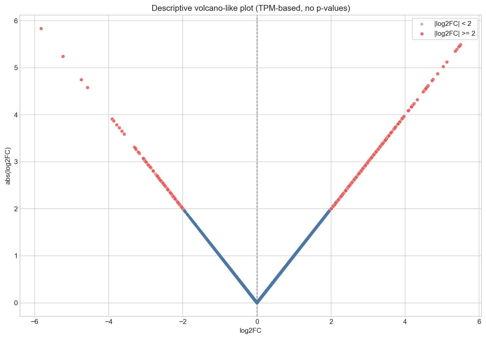
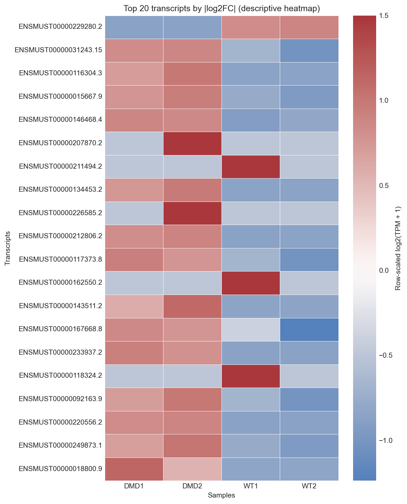
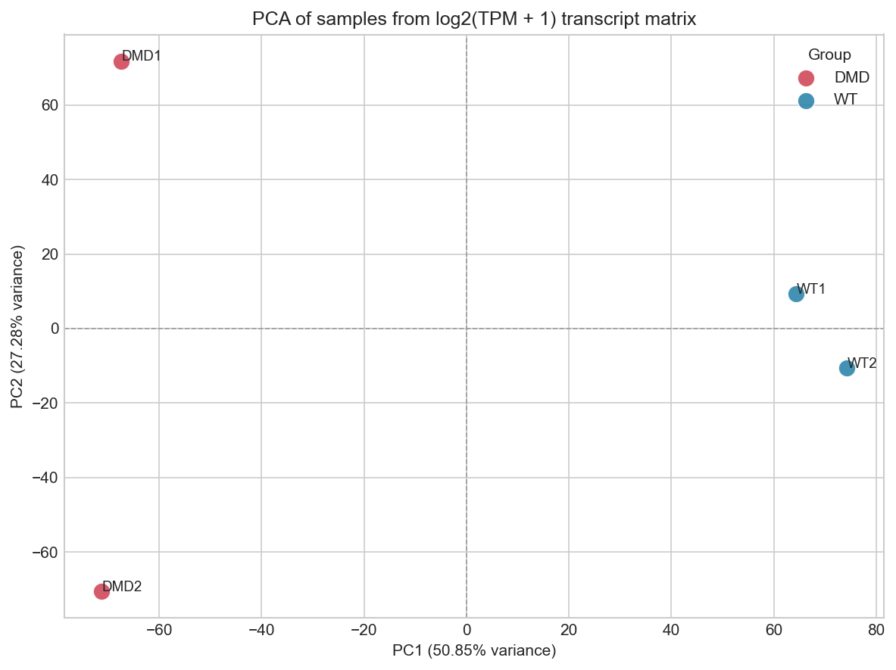
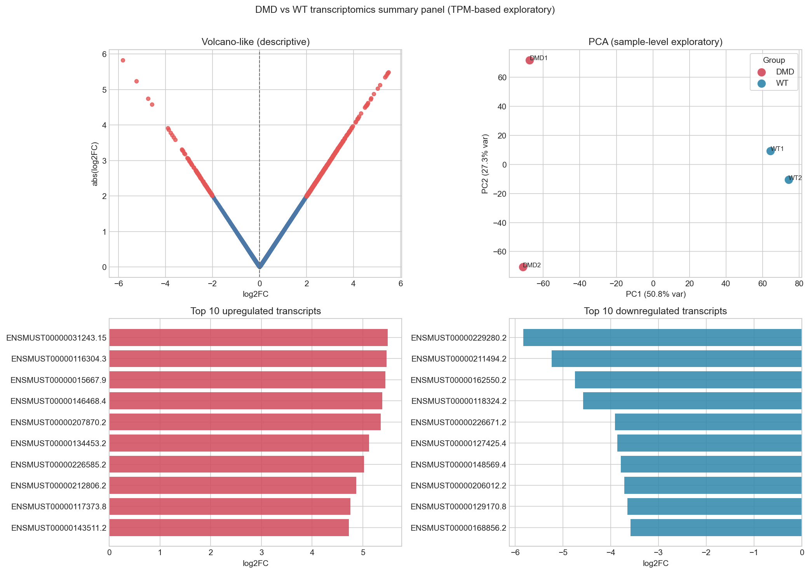

# dmd-rnaseq-downstream-analysis


A polished, standalone computational biology portfolio project for **descriptive, exploratory, TPM-based** transcriptomics visualization in a DMD vs WT comparison.

## Live Demo
- Live demo coming soon.
- Upstream project reference: https://github.com/berfinida/pipeline

## Project Overview
This repository provides downstream visual exploration of transcript-level expression outputs. It is designed for reproducibility, presentation quality, and portfolio use.

## Source Pipeline Context
Upstream processing is handled in a separate Nextflow RNA-seq project:
- https://github.com/berfinida/pipeline

This repository consumes processed TSV outputs only.

## How this connects to the original RNA-seq pipeline
- Original repository: Nextflow pipeline for upstream RNA-seq processing and quantification.
- This repository: downstream visualization and interactive exploratory analysis based on matrix outputs.

## Interactive Dashboard
The repository includes an optional Streamlit dashboard:
- App: `app.py`
- Streamlit docs: `streamlit_app/README.md`
- Usage docs: `docs/streamlit_usage.md`

### Dashboard Features
- Wide layout and sidebar navigation
- Clean section headers and metric cards
- Transcript search (text input + top transcript dropdown)
- Interactive Plotly charts (volcano-like, top transcript bars, selected transcript TPM)
- Figure gallery of generated PNG outputs

### Streamlit Run Command
```bash
streamlit run app.py
```

### Screenshot/Export For Portfolio
1. Launch dashboard with `streamlit run app.py`.
2. Open browser in full-width view.
3. Capture high-resolution screenshots of key sections.
4. Save screenshot to: `docs/dashboard_screenshot.png`.

Screenshot placeholder:


### Safety Note
This app visualizes TPM-based descriptive summaries and does not perform formal statistical differential expression testing.

## Figures
- 
- 
- 
- 

## Repository Structure
```text
dmd-rnaseq-downstream-analysis/
├── app.py
├── README.md
├── requirements.txt
├── environment.yml
├── LICENSE
├── CITATION.cff
├── CHANGELOG.md
├── CONTRIBUTING.md
├── PROJECT_SUMMARY.md
├── data_description.md
├── methods.md
├── results_summary.md
├── portfolio_blurb.md
├── docs/
│   ├── streamlit_usage.md
│   ├── project_architecture.md
│   ├── figure_interpretation.md
│   ├── limitations.md
│   └── dashboard_screenshot.png
├── downstream_analysis/
│   ├── plot_volcano_like.py
│   ├── plot_heatmap.py
│   ├── plot_pca.py
│   ├── plot_summary_panel.py
│   ├── annotate_transcripts.py
│   └── figures/
│       ├── volcano_like_plot.png
│       ├── top_transcripts_heatmap.png
│       ├── pca_plot.png
│       └── summary_panel.png
└── results/matrix/
    ├── expression_matrix.tsv
    ├── dmd_vs_wt_summary.tsv
    ├── top10_upregulated.tsv
    └── top10_downregulated.tsv
```

## Quick Start (pip)
```bash
pip install -r requirements.txt
python downstream_analysis/plot_volcano_like.py
python downstream_analysis/plot_heatmap.py
python downstream_analysis/plot_pca.py
python downstream_analysis/plot_summary_panel.py
streamlit run app.py
```

## Alternative Setup (conda)
```bash
conda env create -f environment.yml
conda activate dmd-downstream
streamlit run app.py
```

## Quality Checks
```bash
python -m py_compile app.py
python downstream_analysis/plot_volcano_like.py
python downstream_analysis/plot_heatmap.py
python downstream_analysis/plot_pca.py
python downstream_analysis/plot_summary_panel.py
```

## Future Improvements
- Add formal DESeq2/edgeR statistical differential analysis workflows.
- Expand transcript-to-gene symbol annotation coverage.
- Add GO/KEGG pathway enrichment modules.
- Support multi-dataset comparison workflows.
- Add Docker containerization for reproducible deployment.
- Deploy Streamlit app on Streamlit Community Cloud.

## Project Documents
- [PROJECT_SUMMARY.md](PROJECT_SUMMARY.md)
- [data_description.md](data_description.md)
- [methods.md](methods.md)
- [results_summary.md](results_summary.md)
- [portfolio_blurb.md](portfolio_blurb.md)
- [docs/project_architecture.md](docs/project_architecture.md)
- [docs/figure_interpretation.md](docs/figure_interpretation.md)
- [docs/limitations.md](docs/limitations.md)

## Not a Formal DE Workflow
This repository is exploratory and descriptive. It does not perform formal inferential differential expression testing unless such methods are explicitly added.
